Confirmatory Factor Analysis
================
John Rollman
May 6, 2021

-   [Packages](#packages)
-   [Data Import](#data-import)
-   [Summary Visualizations](#summary-visualizations)
-   [Normality Assumptions](#normality-assumptions)
-   [Correlations](#correlations)
-   [Exploratory Factor Analysis](#exploratory-factor-analysis)
-   [Confirmatory Factor Analysis (Total Stranger Interactions)](#confirmatory-factor-analysis-total-stranger-interactions)
-   [Factor Score Analysis](#factor-score-analysis)

Packages
========

``` r
library(tidyverse) #Data manipulation and formatting
library(knitr) #Report tools and formatting
library(corrplot) #Pretty correlation plots
library(caret) #Multiuse package containing many models
library(sem) #Structural equation models for CFA
library(psych) #Exploratory factor models
library(randomForest) #Classification trees also in caret
library(gbm) #Logistic classifies for caret and other packages
library(DiagrammeR)
library(rattle)
library(Hmisc)
library(lavaan)
library(MVN)
library(GPArotation)

webshot::install_phantomjs()
```

Data Import
===========

``` r
  BehDat.cntrl <- read.csv("Vole_Beh_R_Supp.csv") %>%
  filter(TRT != "5MT") %>%
  mutate(SP_INDEX_inv = SP_INDEX/-1) %>%
  mutate(NO_TOT_DIST = NO_TRIAL2_TOT_DIST + NO_TRIAL3_TOT_DIST) %>%
  mutate(bidose = ifelse(TRT=="CTRL", "CTRL","TRT")) %>% 
  select(
    
  VOLE_ID,
  TRT,
  SEX,
  bidose,

  NO_TOT_DIST,
  OF_TOT_DIST,
  NS_TOT_DIST,
  SP_TOT_DIST,
  PP_TOT_DIST,
  NS_DUR_STRANGER,
  SP_DUR_STRANGER,
  PP_STRANGER_TOT_DUR
  ) %>% na.omit()

BehDat <- BehDat.cntrl
N <- ncol(BehDat.cntrl)
```

Summary Visualizations
======================

``` r
#Reorder Treatment Levels
BehDat.cntrl$TRT <- factor(BehDat.cntrl$TRT, levels = c("CTRL", "LOW", "MID", "HIGH"))

#Create Boxplots
for(i in 5:N) {
a <- ggplot(BehDat.cntrl,aes(x=bidose,y=BehDat.cntrl[,i])) + 
  geom_boxplot() +
  geom_jitter(aes(color=SEX)) +
  ggtitle(colnames(BehDat.cntrl)[i]) + 
  facet_wrap(~SEX)
print(a)
}
```

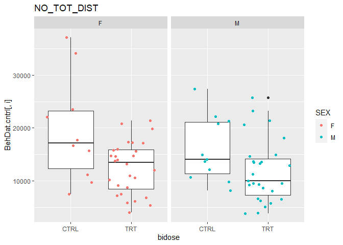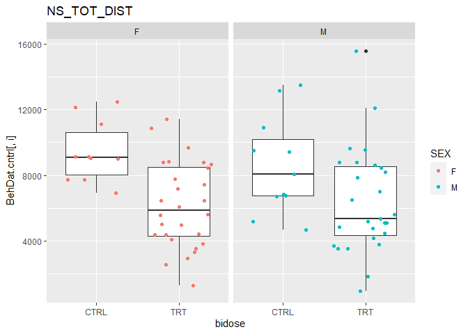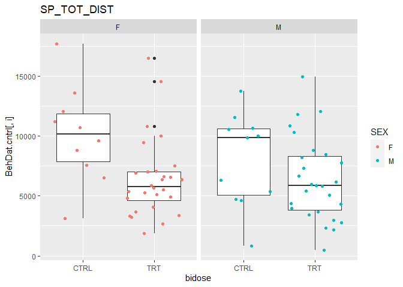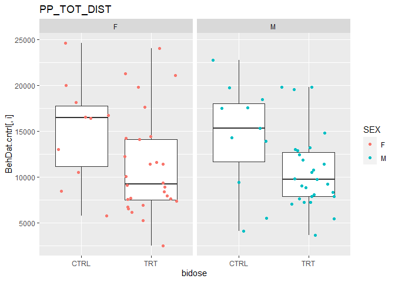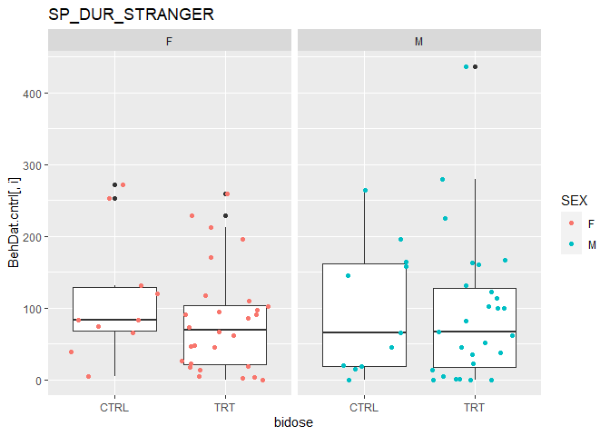

``` r
#Create Boxplots
for(i in 5:N) {
a <- ggplot(BehDat.cntrl,aes(x=TRT,y=BehDat.cntrl[,i])) + 
  geom_boxplot() +
  geom_jitter(aes(color=SEX)) +
  ggtitle(colnames(BehDat.cntrl)[i]) + 
  facet_wrap(~SEX)
print(a)
}
```

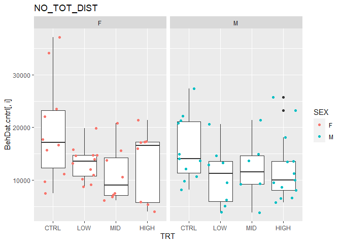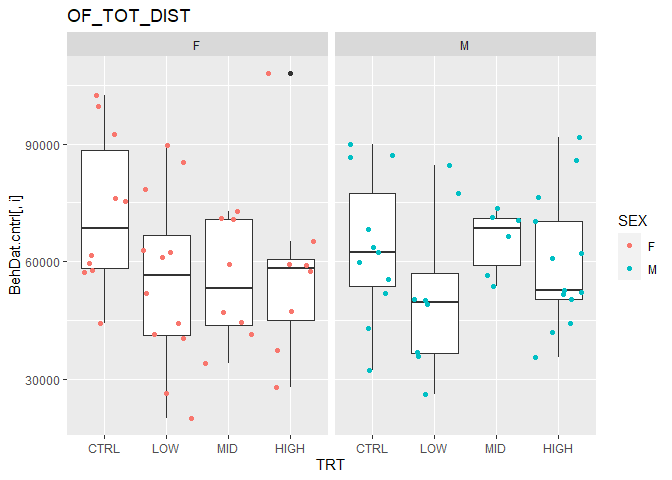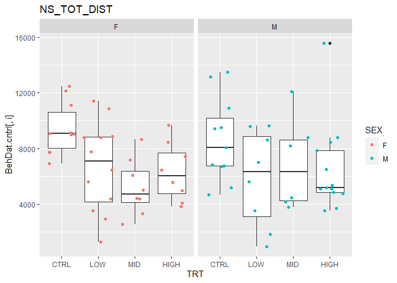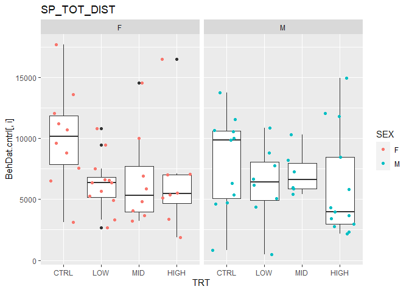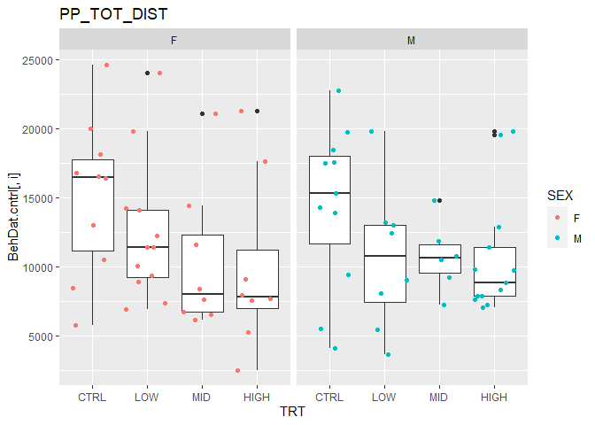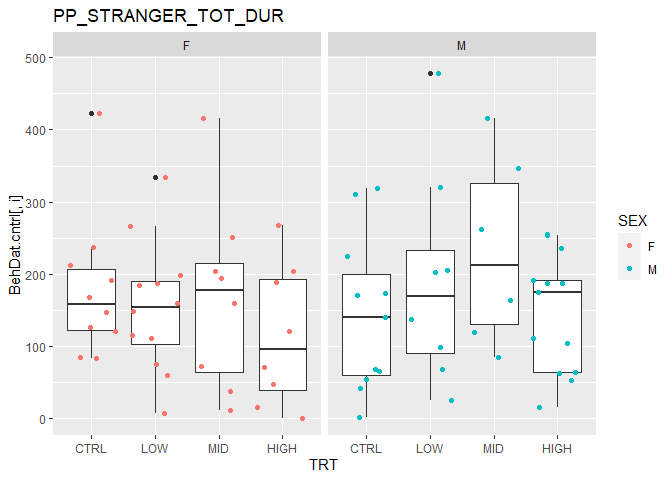

``` r
#Create Histograms
for(i in 5:N) {
a <- ggplot(BehDat.cntrl,aes(scale(BehDat.cntrl[,i]))) + 
  geom_histogram(binwidth = .5) +
  ggtitle(colnames(BehDat.cntrl)[i])
print(a)
}
```


``` r
#Create Histograms
for(i in 5:N) {
a <- ggplot(BehDat.cntrl,aes(BehDat.cntrl[,i])) + 
  geom_histogram() +
  ggtitle(colnames(BehDat.cntrl)[i])
print(a)
}
```

    ## `stat_bin()` using `bins = 30`. Pick better value with `binwidth`.


    ## `stat_bin()` using `bins = 30`. Pick better value with `binwidth`.


    ## `stat_bin()` using `bins = 30`. Pick better value with `binwidth`.


    ## `stat_bin()` using `bins = 30`. Pick better value with `binwidth`.


    ## `stat_bin()` using `bins = 30`. Pick better value with `binwidth`.


    ## `stat_bin()` using `bins = 30`. Pick better value with `binwidth`.


    ## `stat_bin()` using `bins = 30`. Pick better value with `binwidth`.


    ## `stat_bin()` using `bins = 30`. Pick better value with `binwidth`.


``` r
#QQ Plots of Univariate Normality
for(i in 5:N) {
qqnorm(scale(BehDat[,i]), main = colnames(BehDat)[i])
abline(0,1)
}
```


Normality Assumptions
=====================

``` r
#Univariate Normality Tests
mvn(BehDat.cntrl[,5:N])$univariateNormality
```

    ##           Test            Variable Statistic   p value Normality
    ## 1 Shapiro-Wilk     NO_TOT_DIST        0.9343   7e-04      NO    
    ## 2 Shapiro-Wilk     OF_TOT_DIST        0.9867  0.6126      YES   
    ## 3 Shapiro-Wilk     NS_TOT_DIST        0.9813  0.3251      YES   
    ## 4 Shapiro-Wilk     SP_TOT_DIST        0.9598  0.0167      NO    
    ## 5 Shapiro-Wilk     PP_TOT_DIST        0.9500  0.0047      NO    
    ## 6 Shapiro-Wilk   NS_DUR_STRANGER      0.8885  <0.001      NO    
    ## 7 Shapiro-Wilk   SP_DUR_STRANGER      0.8806  <0.001      NO    
    ## 8 Shapiro-Wilk PP_STRANGER_TOT_DUR    0.9493  0.0043      NO

``` r
#Multivariate Normality Tests Full Data
mvn(BehDat.cntrl[,5:N])$multivariateNormality
```

    ##              Test        Statistic              p value Result
    ## 1 Mardia Skewness 224.591409017898 2.37327035079921e-08     NO
    ## 2 Mardia Kurtosis 2.89212860767036  0.00382641279175866     NO
    ## 3             MVN             <NA>                 <NA>     NO

``` r
#MultiVariate Outliers
psych::outlier(BehDat.cntrl[,5:N])
```


    ##         1         2         5         6         7         8         9        10 
    ##  4.924770  7.206021 11.313192  8.810965 11.349433 12.174015 16.084224  3.798471 
    ##        11        12        13        15        16        17        18        19 
    ## 24.084510 20.269713  8.539640  5.757653  4.122267  2.460637  8.218868  6.337365 
    ##        20        21        22        23        24        25        26        28 
    ##  5.052933  3.033441  6.556188  4.901602  5.091132  9.239003  7.122125  3.792804 
    ##        29        31        32        33        34        35        36        37 
    ##  9.058182  5.000235  3.321862  5.982680 13.625658  5.945709  3.530886  5.109578 
    ##        38        39        40        42        43        44        45        46 
    ##  6.317432  3.233111  7.777143  2.803873  6.738061  7.739162  4.144873  1.331467 
    ##        47        48        49        50        51        53        54        55 
    ##  6.301996  3.140668  1.594883  3.635818  5.318109  3.289004  3.190527  7.757013 
    ##        56        57        58        60        61        62        63        65 
    ##  9.350242  2.967024 14.972386  8.426469  5.021785  9.743765 19.651095 10.483957 
    ##        66        67        68        69        71        72        73        74 
    ##  5.898630  4.917003  5.256222  6.629079  6.331870  7.749944 18.707813  3.874637 
    ##        75        76        77        78        79        80        81        82 
    ## 10.503296 19.055410 10.194123  5.100855 18.982783  5.728210  9.269426 13.703162 
    ##        83        84        86        87 
    ## 16.471481  4.476908 10.423443  9.980082

``` r
md <- mahalanobis(BehDat.cntrl[,5:N], center = colMeans(BehDat.cntrl[,5:N]), cov = cov(BehDat.cntrl[,5:N]))
alpha <- .05
cutoff <- (qchisq(p = 1 - alpha, df = ncol(BehDat.cntrl[,5:N])))
names_outliers_MH <- which(md > cutoff)
excluded_mh <- names_outliers_MH
BehDat.clean <- BehDat.cntrl[-excluded_mh, ]
BehDat.cntrl[excluded_mh, ]
```

    ##    VOLE_ID  TRT SEX bidose NO_TOT_DIST OF_TOT_DIST NS_TOT_DIST SP_TOT_DIST
    ## 9      100  LOW   F    TRT    14586.32    89651.41    11403.55     6357.65
    ## 11     240  LOW   M    TRT    13247.24    50260.21     7017.38     7776.55
    ## 12     115  MID   M    TRT     9206.03    66547.37    12071.38     5397.70
    ## 63     118  LOW   M    TRT     5079.34    84551.70      970.11     6150.77
    ## 73      25 CTRL   F   CTRL    34146.01    99487.90     7711.84    13615.56
    ## 76     239 CTRL   F   CTRL    37148.55   102330.20    12145.68    17682.69
    ## 79     140 HIGH   F    TRT     5318.38   108014.24     6476.99     6994.57
    ## 83     197 HIGH   M    TRT     6493.06    42034.91     3527.24     2764.85
    ##    PP_TOT_DIST NS_DUR_STRANGER SP_DUR_STRANGER PP_STRANGER_TOT_DUR
    ## 9     24046.73          133.53          171.14              186.72
    ## 11    12960.20          204.64          436.27              202.54
    ## 12    10750.26           29.53          122.86              416.58
    ## 63    19812.46          190.52          102.34              204.50
    ## 73    10489.75           33.90           65.53              212.21
    ## 76    16740.04            1.77           82.75              120.25
    ## 79     7938.34           35.90           94.63               46.25
    ## 83     7867.31          414.78          166.20               52.42

``` r
psych::outlier(BehDat.clean[,5:N])
```


    ##         1         2         5         6         7         8        10        13 
    ##  6.634019  9.483911 13.785646 10.831975 14.614310 14.416972  3.882590  9.415907 
    ##        15        16        17        18        19        20        21        22 
    ##  7.842837  5.080425  2.436416 10.521681  6.296086  5.163644  3.021169  6.869630 
    ##        23        24        25        26        28        29        31        32 
    ##  5.495161  5.865175 11.884975  6.965591  3.813394 12.696770  5.120620  4.169479 
    ##        33        34        35        36        37        38        39        40 
    ##  8.916738 18.059859  6.641050  6.023411  5.836637  6.979330  3.510208 10.171394 
    ##        42        43        44        45        46        47        48        49 
    ##  2.922914  6.632085  8.470148  5.505343  1.613534  6.712723  3.196198  2.358368 
    ##        50        51        53        54        55        56        57        58 
    ##  5.089751  5.093937  4.811738  3.742961  7.644894 13.102781  4.649964 15.253012 
    ##        60        61        62        65        66        67        68        69 
    ## 10.883619  5.540172  9.678966 11.477874  7.222190  5.306813  8.468590 11.628350 
    ##        71        72        74        75        77        78        80        81 
    ##  7.956107  8.797285  5.030881 11.921585 14.355710  6.326730  6.805216 12.072400 
    ##        82        84        86        87 
    ## 14.977312  6.619728 11.113004 10.570112

``` r
#Univariate Normality Tests w/o Outliers
mvn(BehDat.clean[,5:N])$univariateNormality
```

    ##           Test            Variable Statistic   p value Normality
    ## 1 Shapiro-Wilk     NO_TOT_DIST        0.9720  0.1296      YES   
    ## 2 Shapiro-Wilk     OF_TOT_DIST        0.9864  0.6684      YES   
    ## 3 Shapiro-Wilk     NS_TOT_DIST        0.9701  0.1013      YES   
    ## 4 Shapiro-Wilk     SP_TOT_DIST        0.9666  0.0651      YES   
    ## 5 Shapiro-Wilk     PP_TOT_DIST        0.9519  0.0106      NO    
    ## 6 Shapiro-Wilk   NS_DUR_STRANGER      0.8881  <0.001      NO    
    ## 7 Shapiro-Wilk   SP_DUR_STRANGER      0.8834  <0.001      NO    
    ## 8 Shapiro-Wilk PP_STRANGER_TOT_DUR    0.9522  0.0109      NO

``` r
#Multivariate Tests W/o Outliers
mvn(BehDat.clean[,5:N])$multivariateNormality
```

    ##              Test          Statistic           p value Result
    ## 1 Mardia Skewness   125.236735694877 0.353410002939259    YES
    ## 2 Mardia Kurtosis -0.626276555952885 0.531133560791075    YES
    ## 3             MVN               <NA>              <NA>    YES

Correlations
============

``` r
#Full Data
res2.A <-rcorr(as.matrix(BehDat.cntrl[,5:N]),type = "pearson")
corrplot(res2.A$r, type="upper", order="hclust",tl.cex=.8)
```


``` r
#Clean Data
res2.A <-rcorr(as.matrix(BehDat.clean[,5:N]),type = "pearson")
corrplot(res2.A$r, type="upper", order="hclust")
```


``` r
#Full Data Male
res2.A <-rcorr(as.matrix(BehDat.cntrl[BehDat.cntrl$SEX == 'M',5:N]),type = "pearson")
corrplot(res2.A$r, type="upper", order="hclust", title = 'Full Data Male')
```


``` r
#Full Data Female
res2.A <-rcorr(as.matrix(BehDat.cntrl[BehDat.cntrl$SEX == 'F',5:N]),type = "pearson")
corrplot(res2.A$r, type="upper", order="hclust", title = 'Full Data Female')
```


``` r
#Table Count
table(BehDat.cntrl$bidose,BehDat.cntrl$SEX)
```

    ##       
    ##         F  M
    ##   CTRL 10 11
    ##   TRT  28 27

``` r
#Correlations of Sex and Exposure
res.1 <-rcorr(as.matrix(filter(BehDat.cntrl, SEX == 'M' & bidose == 'CTRL')[,5:N]),type = "pearson")
res.2 <-rcorr(as.matrix(filter(BehDat.cntrl, SEX == 'M' & bidose == 'TRT')[,5:N]),type = "pearson")
res.3 <-rcorr(as.matrix(filter(BehDat.cntrl, SEX == 'F' & bidose == 'CTRL')[,5:N]),type = "pearson")
res.4 <-rcorr(as.matrix(filter(BehDat.cntrl, SEX == 'F' & bidose == 'TRT')[,5:N]),type = "pearson")

#Corrplots of Sex and Exposure
corrplot(res.1$r, type="upper" , title = 'MALE CTRL',tl.cex=.8,mar=c(0,0,2,0))
```


``` r
corrplot(res.2$r, type="upper" , title = 'MALE TRT',tl.cex=.8,mar=c(0,0,2,0))
```


``` r
corrplot(res.3$r, type="upper" , title = 'FEMALE CTRL',tl.cex=.8,mar=c(0,0,2,0))
```


``` r
corrplot(res.4$r, type="upper" , title = 'FEMALE TRT',tl.cex=.8,mar=c(0,0,2,0))
```


Exploratory Factor Analysis
===========================

``` r
#Inputs

#Preprocessing
X <- BehDat.cntrl[,5:N]
X.c <- BehDat.clean[,5:N]

for (i in 1:5) {
  X[,i] <- max(X[,i])-X[,i]
  X.c[,i] <- max(X.c[,i])-X.c[,i]
}

X <- scale(X)
X.c <- scale(X.c)

#Parallel Analysis
fa.parallel(X, n.iter =100, fm = "ml", fa="fa")
```


    ## Parallel analysis suggests that the number of factors =  2  and the number of components =  NA

``` r
fa.parallel(X.c, n.iter =100, fm = "ml", fa="fa")
```


    ## Parallel analysis suggests that the number of factors =  2  and the number of components =  NA

``` r
f <- 2

#EFA Full Data
fa.out.none <- fa(X, fm="ml",nfactors = f, rotate="none")
fa.out.varimax <- fa(X, fm="ml",nfactors = f, rotate="varimax")
fa.out.quartimax <- fa(X, fm="ml",nfactors = f, rotate="quartimax")

Results <- rbind(fa.out.none$TLI,fa.out.none$PVAL,fa.out.none$RMSEA[1])
rownames(Results) <- c("Tucker Lewis Index", "ChiSq Pval","RMSEA")
colnames(Results) <- "Fit"
round(Results,2)
```

    ##                     Fit
    ## Tucker Lewis Index 1.06
    ## ChiSq Pval         0.87
    ## RMSEA              0.00

``` r
par(mfrow= c(1,3))
fa.diagram(fa.out.none, cut = 0.2, simple = F, main = "No Rotation")
fa.diagram(fa.out.varimax, cut =0.2, simple = F, main = "Varimax rotation")
fa.diagram(fa.out.quartimax,cut =0.16, simple = F, main = "Qaurtimax roation")
```


``` r
#EFA Fo Outliers
fa.out.none <- fa(X.c, fm="ml",nfactors = f, rotate="none")
fa.out.varimax <- fa(X.c, fm="ml",nfactors = f, rotate="varimax")
fa.out.quartimax <- fa(X.c, fm="ml",nfactors = f, rotate="quartimax")

Results <- rbind(fa.out.none$TLI,fa.out.none$PVAL,fa.out.none$RMSEA[1])
rownames(Results) <- c("Tucker Lewis Index", "ChiSq Pval","RMSEA")
round(Results,2)
```

    ##                    RMSEA
    ## Tucker Lewis Index  0.92
    ## ChiSq Pval          0.08
    ## RMSEA               0.09

``` r
par(mfrow= c(1,3))
fa.diagram(fa.out.none, cut = 0.2, simple = F, main = "No Rotation")
fa.diagram(fa.out.varimax, cut =0.2, simple = F, main = "Varimax rotation")
fa.diagram(fa.out.quartimax, cut=0.2, simple = F, main = "Qaurtimax roation")
```


Confirmatory Factor Analysis (Total Stranger Interactions)
==========================================================

``` r
#Preprocessing
CFADat <- BehDat.cntrl[,5:N]
CFADat.c <- BehDat.clean[,5:N]

for (i in 1:5) {
  CFADat[,i] <- max(CFADat[,i])-CFADat[,i]
  CFADat.c[,i] <- max(CFADat.c[,i])-CFADat.c[,i]
}

CFADat <- data.frame(scale(CFADat))
CFADat.c <- data.frame(scale(CFADat.c))

#Model Specification
textModel <-  sem::specifyModel(text="
##Specification of Anxiety
ANX   -> NO_TOT_DIST,              lambda11,   NA
ANX   -> OF_TOT_DIST,              lambda21,   NA
ANX   -> NS_TOT_DIST,              lambda31,   NA
ANX   -> PP_TOT_DIST,              lambda41,   NA
ANX   -> SP_TOT_DIST,              lambda51,   NA
##Specification of Social
SOC   -> NS_DUR_STRANGER,       lambda12,   NA
SOC   -> PP_STRANGER_TOT_DUR,   lambda22,   NA
SOC   -> SP_DUR_STRANGER,       lambda32,   NA
##Uniqueness of Variables
NO_TOT_DIST             <->  NO_TOT_DIST,               psi1,    NA
OF_TOT_DIST             <->  OF_TOT_DIST,               psi2,    NA
NS_TOT_DIST             <->  NS_TOT_DIST,               psi3,    NA
PP_TOT_DIST             <->  PP_TOT_DIST,               psi4,    NA
SP_TOT_DIST             <->  SP_TOT_DIST,               psi5,    NA
NS_DUR_STRANGER         <->  NS_DUR_STRANGER,           psi6,    NA
PP_STRANGER_TOT_DUR     <->  PP_STRANGER_TOT_DUR,       psi7,    NA
SP_DUR_STRANGER         <->  SP_DUR_STRANGER,           psi8,    NA
##Assumed Fixed Variances of Factors (since data is scaled?)
ANX   <->   ANX,   NA,  1
SOC   <->   SOC,   NA,  1
##Correlation Between Latent Variables
ANX   <->   SOC,    rho1, NA
")
```

    ## NOTE: it is generally simpler to use specifyEquations() or cfa()
    ##       see ?specifyEquations

``` r
#CFA for All Data
Risk_Model1 <- sem::sem(model = textModel,
                  data = CFADat,
                  standardized = T,
                  objective=objectiveML
                  )

 # Model Chisquare =  22.09628   Df =  19 Pr(>Chisq) = 0.2794909
 # Goodness-of-fit index =  0.9334547
 # Adjusted goodness-of-fit index =  0.8739142
 # RMSEA index =  0.04661358   90% CI: (NA, 0.1155219)
 # Bentler-Bonett NFI =  0.9031891
 # Tucker-Lewis NNFI =  0.9772129

 #1 Estimate insig (8.763709e-02    SP_DUR_STRANGER <--> SP_DUR_STRANGER)

#CFA for All Data
Risk_Model2 <- sem::sem(model = textModel,
                  data = CFADat,
                  standardized = T,
                  objective=objectiveGLS
                  )

 # Model Chisquare =  18.69105   Df =  19 Pr(>Chisq) = 0.4768105
 # Goodness-of-fit index =  0.9376965
 # Adjusted goodness-of-fit index =  0.8819513
 # RMSEA index =  0   90% CI: (NA, 0.09925957)
 # Bentler-Bonett NFI =  0.9697971
 # Tucker-Lewis NNFI =  1.000771

 #No insig Estimates

#CFA w/o outliers
Risk_Model3 <- sem::sem(model = textModel,
                  data = CFADat.c,
                  standardized = T,
                  objective=objectiveML
                  )

 # Model Chisquare =  41.12428   Df =  19 Pr(>Chisq) = 0.002323121
 # Goodness-of-fit index =  0.8674984
 # Adjusted goodness-of-fit index =  0.7489442
 # RMSEA index =  0.1318319   90% CI: (0.07607498, 0.187205)
 # Bentler-Bonett NFI =  0.8451127
 # Tucker-Lewis NNFI =  0.8627255

#CFA w/o outliers
Risk_Model4 <- sem::sem(model = textModel,
                  data = CFADat.c,
                  standardized = T,
                  objective=objectiveGLS
                  )

 # Model Chisquare =  28.62445   Df =  19 Pr(>Chisq) = 0.07212646
 # Goodness-of-fit index =  0.8931924
 # Adjusted goodness-of-fit index =  0.7976276
 # RMSEA index =  0.08695082   90% CI: (NA, 0.1486247)
 # Bentler-Bonett NFI =  0.9793594
 # Tucker-Lewis NNFI =  0.9895619

#Fit and Summary
summary(Risk_Model2, fit.indices=c("GFI", "AGFI", "RMSEA", "NFI", "NNFI", "CFI", "RNI",
"IFI", "SRMR", "AIC", "AICc", "BIC", "CAIC"))
```

    ## 
    ##  Model Chisquare =  18.69105   Df =  19 Pr(>Chisq) = 0.4768105
    ##  Goodness-of-fit index =  0.9376965
    ##  Adjusted goodness-of-fit index =  0.8819513
    ##  RMSEA index =  0   90% CI: (NA, 0.09925957)
    ##  Bentler-Bonett NFI =  0.9697971
    ##  Tucker-Lewis NNFI =  1.000771
    ##  Bentler CFI =  1
    ##  Bentler RNI =  1.000523
    ##  Bollen IFI =  1.000515
    ##  SRMR =  0.08891685
    ## 
    ##  Normalized Residuals
    ##     Min.  1st Qu.   Median     Mean  3rd Qu.     Max. 
    ## -0.99434 -0.12222 -0.02868  0.18420  0.35386  2.11986 
    ## 
    ##  R-square for Endogenous Variables
    ##         NO_TOT_DIST         OF_TOT_DIST         NS_TOT_DIST         PP_TOT_DIST 
    ##              0.4990              0.4069              0.5565              0.5701 
    ##         SP_TOT_DIST     NS_DUR_STRANGER PP_STRANGER_TOT_DUR     SP_DUR_STRANGER 
    ##              0.7795              0.5738              0.0848              0.6691 
    ## 
    ##  Parameter Estimates
    ##          Estimate   Std Error  z value   Pr(>|z|)    
    ## lambda11  0.6524931 0.12765573  5.111350 3.198647e-07
    ## lambda21  0.6197318 0.11608358  5.338669 9.363161e-08
    ## lambda31  0.7329260 0.10913082  6.716031 1.867412e-11
    ## lambda41  0.7397119 0.10730244  6.893709 5.435599e-12
    ## lambda51  0.8730125 0.09965670  8.760199 1.949066e-18
    ## lambda12  0.6686076 0.13826382  4.835738 1.326524e-06
    ## lambda22  0.2849193 0.13552158  2.102391 3.551905e-02
    ## lambda32  0.7446642 0.13350053  5.577987 2.433178e-08
    ## psi1      0.4274297 0.09176158  4.658047 3.192240e-06
    ## psi2      0.5598372 0.10412107  5.376791 7.582506e-08
    ## psi3      0.4280626 0.08882426  4.819208 1.441294e-06
    ## psi4      0.4126696 0.08365710  4.932870 8.103014e-07
    ## psi5      0.2156090 0.06779553  3.180283 1.471311e-03
    ## psi6      0.3320531 0.11658089  2.848263 4.395855e-03
    ## psi7      0.8758049 0.15076062  5.809242 6.275642e-09
    ## psi8      0.2742979 0.12886074  2.128638 3.328419e-02
    ## rho1     -0.6182661 0.13386833 -4.618464 3.865909e-06
    ##                                                      
    ## lambda11 NO_TOT_DIST <--- ANX                        
    ## lambda21 OF_TOT_DIST <--- ANX                        
    ## lambda31 NS_TOT_DIST <--- ANX                        
    ## lambda41 PP_TOT_DIST <--- ANX                        
    ## lambda51 SP_TOT_DIST <--- ANX                        
    ## lambda12 NS_DUR_STRANGER <--- SOC                    
    ## lambda22 PP_STRANGER_TOT_DUR <--- SOC                
    ## lambda32 SP_DUR_STRANGER <--- SOC                    
    ## psi1     NO_TOT_DIST <--> NO_TOT_DIST                
    ## psi2     OF_TOT_DIST <--> OF_TOT_DIST                
    ## psi3     NS_TOT_DIST <--> NS_TOT_DIST                
    ## psi4     PP_TOT_DIST <--> PP_TOT_DIST                
    ## psi5     SP_TOT_DIST <--> SP_TOT_DIST                
    ## psi6     NS_DUR_STRANGER <--> NS_DUR_STRANGER        
    ## psi7     PP_STRANGER_TOT_DUR <--> PP_STRANGER_TOT_DUR
    ## psi8     SP_DUR_STRANGER <--> SP_DUR_STRANGER        
    ## rho1     SOC <--> ANX                                
    ## 
    ##  Iterations =  20

``` r
round(Risk_Model2$S - Risk_Model2$C,2)
```

    ##                     NO_TOT_DIST OF_TOT_DIST NS_TOT_DIST SP_TOT_DIST PP_TOT_DIST
    ## NO_TOT_DIST                0.15        0.04       -0.02        0.02        0.03
    ## OF_TOT_DIST                0.04        0.06       -0.01       -0.01        0.05
    ## NS_TOT_DIST               -0.02       -0.01        0.03       -0.02       -0.01
    ## SP_TOT_DIST                0.02       -0.01       -0.02        0.02       -0.01
    ## PP_TOT_DIST                0.03        0.05       -0.01       -0.01        0.04
    ## NS_DUR_STRANGER            0.24        0.05       -0.10        0.04       -0.01
    ## SP_DUR_STRANGER            0.19        0.13        0.00       -0.04       -0.01
    ## PP_STRANGER_TOT_DUR       -0.03       -0.05        0.00       -0.05       -0.12
    ##                     NS_DUR_STRANGER SP_DUR_STRANGER PP_STRANGER_TOT_DUR
    ## NO_TOT_DIST                    0.24            0.19               -0.03
    ## OF_TOT_DIST                    0.05            0.13               -0.05
    ## NS_TOT_DIST                   -0.10            0.00                0.00
    ## SP_TOT_DIST                    0.04           -0.04               -0.05
    ## PP_TOT_DIST                   -0.01           -0.01               -0.12
    ## NS_DUR_STRANGER                0.22            0.14               -0.01
    ## SP_DUR_STRANGER                0.14            0.17               -0.01
    ## PP_STRANGER_TOT_DUR           -0.01           -0.01                0.04

``` r
Vhat <- Risk_Model2$vcov
corrplot(cov2cor(Vhat))
```


``` r
pathDiagram(Risk_Model2,
            ignore.double =  F,
            edge.labels = "both",
            file = "Risk_Model_plot",
            output.type = "dot",
            node.colors = c("steelblue","transparent"))

grViz("Risk_Model_plot.dot")
```


Factor Score Analysis
=====================

``` r
FS <- fscores(Risk_Model2)

newdat <- cbind(BehDat.cntrl[,1:4],FS)
N <- ncol(newdat)
#Reorder Treatment Levels
newdat$TRT <- factor(newdat$TRT, levels = c("CTRL", "LOW", "MID", "HIGH"))

#Create Boxplots
for(i in 5:N) {
a <- ggplot(newdat,aes(x=bidose,y=newdat[,i])) + 
  geom_boxplot() +
  geom_jitter(aes(color=SEX)) +
  ggtitle(colnames(newdat)[i]) + 
  facet_wrap(~SEX)
print(a)
}
```


``` r
#Create Boxplots
for(i in 5:N) {
a <- ggplot(newdat,aes(x=TRT,y=newdat[,i])) + 
  geom_boxplot() +
  geom_jitter(aes(color=SEX)) +
  ggtitle(colnames(newdat)[i]) + 
  facet_wrap(~SEX)
print(a)
}
```

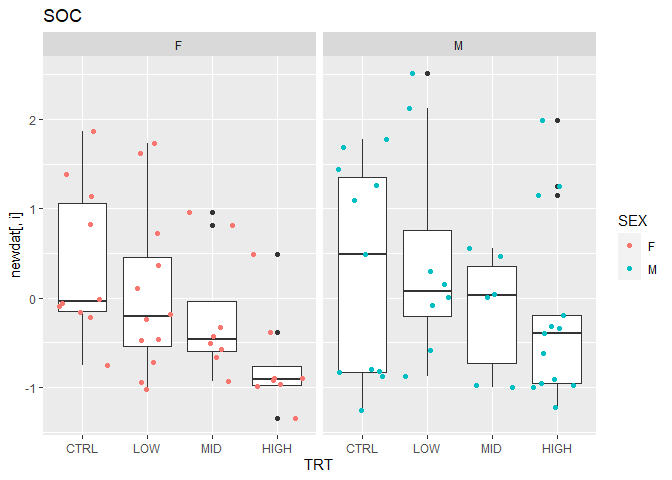

``` r
fit1.A <- lm(ANX~TRT*SEX, data=newdat)
summary(fit1.A)
```

    ## 
    ## Call:
    ## lm(formula = ANX ~ TRT * SEX, data = newdat)
    ## 
    ## Residuals:
    ##      Min       1Q   Median       3Q      Max 
    ## -2.66054 -0.54952  0.09291  0.67205  1.72538 
    ## 
    ## Coefficients:
    ##              Estimate Std. Error t value Pr(>|t|)   
    ## (Intercept)   -0.8586     0.2842  -3.021  0.00355 **
    ## TRTLOW         0.9920     0.3848   2.578  0.01211 * 
    ## TRTMID         1.2014     0.4263   2.818  0.00632 **
    ## TRTHIGH        1.1609     0.4263   2.723  0.00821 **
    ## SEXM           0.4653     0.3927   1.185  0.24020   
    ## TRTLOW:SEXM   -0.3018     0.5679  -0.531  0.59681   
    ## TRTMID:SEXM   -0.7389     0.6243  -1.183  0.24074   
    ## TRTHIGH:SEXM  -0.5092     0.5633  -0.904  0.36923   
    ## ---
    ## Signif. codes:  0 '***' 0.001 '**' 0.01 '*' 0.05 '.' 0.1 ' ' 1
    ## 
    ## Residual standard error: 0.8987 on 68 degrees of freedom
    ## Multiple R-squared:  0.1861, Adjusted R-squared:  0.1023 
    ## F-statistic: 2.222 on 7 and 68 DF,  p-value: 0.04289

``` r
summary.aov(fit1.A)
```

    ##             Df Sum Sq Mean Sq F value  Pr(>F)   
    ## TRT          3  11.03   3.677   4.553 0.00575 **
    ## SEX          1   0.23   0.232   0.287 0.59391   
    ## TRT:SEX      3   1.30   0.432   0.535 0.65981   
    ## Residuals   68  54.92   0.808                   
    ## ---
    ## Signif. codes:  0 '***' 0.001 '**' 0.01 '*' 0.05 '.' 0.1 ' ' 1

``` r
#plot(fit1.A)

fit1.S <- lm(SOC~TRT*SEX, data=newdat)
summary(fit1.S)
```

    ## 
    ## Call:
    ## lm(formula = SOC ~ TRT * SEX, data = newdat)
    ## 
    ## Residuals:
    ##     Min      1Q  Median      3Q     Max 
    ## -1.5410 -0.6372 -0.2197  0.6866  2.1874 
    ## 
    ## Coefficients:
    ##              Estimate Std. Error t value Pr(>|t|)  
    ## (Intercept)    0.3891     0.2995   1.299   0.1983  
    ## TRTLOW        -0.3475     0.4055  -0.857   0.3945  
    ## TRTMID        -0.5964     0.4493  -1.328   0.1888  
    ## TRTHIGH       -1.1295     0.4493  -2.514   0.0143 *
    ## SEXM          -0.1053     0.4138  -0.255   0.7998  
    ## TRTLOW:SEXM    0.5062     0.5985   0.846   0.4007  
    ## TRTMID:SEXM    0.1594     0.6580   0.242   0.8093  
    ## TRTHIGH:SEXM   0.6499     0.5936   1.095   0.2775  
    ## ---
    ## Signif. codes:  0 '***' 0.001 '**' 0.01 '*' 0.05 '.' 0.1 ' ' 1
    ## 
    ## Residual standard error: 0.9471 on 68 degrees of freedom
    ## Multiple R-squared:  0.133,  Adjusted R-squared:  0.04371 
    ## F-statistic:  1.49 on 7 and 68 DF,  p-value: 0.1857

``` r
summary.aov(fit1.S)
```

    ##             Df Sum Sq Mean Sq F value Pr(>F)  
    ## TRT          3   7.05  2.3490   2.619 0.0579 .
    ## SEX          1   0.98  0.9825   1.095 0.2990  
    ## TRT:SEX      3   1.33  0.4417   0.492 0.6887  
    ## Residuals   68  61.00  0.8971                 
    ## ---
    ## Signif. codes:  0 '***' 0.001 '**' 0.01 '*' 0.05 '.' 0.1 ' ' 1

``` r
#plot(fit1.S)

fit2.A <- lm(ANX~bidose*SEX, data=newdat)
summary(fit2.A)
```

    ## 
    ## Call:
    ## lm(formula = ANX ~ bidose * SEX, data = newdat)
    ## 
    ## Residuals:
    ##      Min       1Q   Median       3Q      Max 
    ## -2.62990 -0.53938  0.09624  0.65204  1.72538 
    ## 
    ## Coefficients:
    ##                Estimate Std. Error t value Pr(>|t|)   
    ## (Intercept)     -0.8586     0.2773  -3.096  0.00280 **
    ## bidoseTRT        1.1001     0.3231   3.405  0.00108 **
    ## SEXM             0.4653     0.3832   1.214  0.22864   
    ## bidoseTRT:SEXM  -0.4790     0.4503  -1.064  0.29102   
    ## ---
    ## Signif. codes:  0 '***' 0.001 '**' 0.01 '*' 0.05 '.' 0.1 ' ' 1
    ## 
    ## Residual standard error: 0.877 on 72 degrees of freedom
    ## Multiple R-squared:  0.1794, Adjusted R-squared:  0.1452 
    ## F-statistic: 5.247 on 3 and 72 DF,  p-value: 0.002484

``` r
summary.aov(fit2.A)
```

    ##             Df Sum Sq Mean Sq F value   Pr(>F)    
    ## bidose       1  10.97  10.971  14.264 0.000324 ***
    ## SEX          1   0.27   0.266   0.346 0.558110    
    ## bidose:SEX   1   0.87   0.870   1.131 0.291017    
    ## Residuals   72  55.38   0.769                     
    ## ---
    ## Signif. codes:  0 '***' 0.001 '**' 0.01 '*' 0.05 '.' 0.1 ' ' 1

``` r
#plot(fit2.A)

fit2.S <- lm(SOC~bidose*SEX, data=newdat)
summary(fit2.S)
```

    ## 
    ## Call:
    ## lm(formula = SOC ~ bidose * SEX, data = newdat)
    ## 
    ## Residuals:
    ##     Min      1Q  Median      3Q     Max 
    ## -1.5410 -0.6832 -0.2149  0.6529  2.5099 
    ## 
    ## Coefficients:
    ##                Estimate Std. Error t value Pr(>|t|)  
    ## (Intercept)      0.3891     0.3031   1.283   0.2035  
    ## bidoseTRT       -0.6421     0.3531  -1.818   0.0732 .
    ## SEXM            -0.1053     0.4188  -0.252   0.8021  
    ## bidoseTRT:SEXM   0.3610     0.4922   0.733   0.4657  
    ## ---
    ## Signif. codes:  0 '***' 0.001 '**' 0.01 '*' 0.05 '.' 0.1 ' ' 1
    ## 
    ## Residual standard error: 0.9586 on 72 degrees of freedom
    ## Multiple R-squared:  0.05958,    Adjusted R-squared:  0.02039 
    ## F-statistic:  1.52 on 3 and 72 DF,  p-value: 0.2165

``` r
summary.aov(fit2.S)
```

    ##             Df Sum Sq Mean Sq F value Pr(>F)  
    ## bidose       1   3.23   3.235   3.520 0.0647 .
    ## SEX          1   0.46   0.462   0.503 0.4804  
    ## bidose:SEX   1   0.49   0.494   0.538 0.4657  
    ## Residuals   72  66.16   0.919                 
    ## ---
    ## Signif. codes:  0 '***' 0.001 '**' 0.01 '*' 0.05 '.' 0.1 ' ' 1

``` r
stats::anova(fit2.A,fit1.A)
```

    ## Analysis of Variance Table
    ## 
    ## Model 1: ANX ~ bidose * SEX
    ## Model 2: ANX ~ TRT * SEX
    ##   Res.Df    RSS Df Sum of Sq      F Pr(>F)
    ## 1     72 55.376                           
    ## 2     68 54.923  4    0.4531 0.1402 0.9667

``` r
stats::anova(fit2.S,fit1.S)
```

    ## Analysis of Variance Table
    ## 
    ## Model 1: SOC ~ bidose * SEX
    ## Model 2: SOC ~ TRT * SEX
    ##   Res.Df    RSS Df Sum of Sq      F Pr(>F)
    ## 1     72 66.164                           
    ## 2     68 61.001  4    5.1631 1.4389 0.2307

``` r
fit <- manova(cbind(ANX,SOC)~TRT*SEX, data=newdat)
summary(fit)
```

    ##           Df   Pillai approx F num Df den Df   Pr(>F)   
    ## TRT        3 0.254038   3.2980      6    136 0.004623 **
    ## SEX        1 0.050393   1.7777      2     67 0.176899   
    ## TRT:SEX    3 0.053596   0.6242      6    136 0.710706   
    ## Residuals 68                                            
    ## ---
    ## Signif. codes:  0 '***' 0.001 '**' 0.01 '*' 0.05 '.' 0.1 ' ' 1

``` r
fit <- manova(cbind(ANX,SOC)~bidose*SEX, data=newdat)
summary(fit)
```

    ##            Df   Pillai approx F num Df den Df   Pr(>F)   
    ## bidose      1 0.168843   7.2115      2     71 0.001408 **
    ## SEX         1 0.030033   1.0992      2     71 0.338746   
    ## bidose:SEX  1 0.015586   0.5621      2     71 0.572539   
    ## Residuals  72                                            
    ## ---
    ## Signif. codes:  0 '***' 0.001 '**' 0.01 '*' 0.05 '.' 0.1 ' ' 1

``` r
summary.aov(fit)
```

    ##  Response ANX :
    ##             Df Sum Sq Mean Sq F value    Pr(>F)    
    ## bidose       1 10.971 10.9710 14.2644 0.0003242 ***
    ## SEX          1  0.266  0.2663  0.3462 0.5581100    
    ## bidose:SEX   1  0.870  0.8702  1.1315 0.2910166    
    ## Residuals   72 55.376  0.7691                      
    ## ---
    ## Signif. codes:  0 '***' 0.001 '**' 0.01 '*' 0.05 '.' 0.1 ' ' 1
    ## 
    ##  Response SOC :
    ##             Df Sum Sq Mean Sq F value  Pr(>F)  
    ## bidose       1  3.235  3.2349  3.5202 0.06468 .
    ## SEX          1  0.462  0.4623  0.5031 0.48043  
    ## bidose:SEX   1  0.494  0.4943  0.5379 0.46567  
    ## Residuals   72 66.164  0.9189                  
    ## ---
    ## Signif. codes:  0 '***' 0.001 '**' 0.01 '*' 0.05 '.' 0.1 ' ' 1

``` r
hist(newdat$ANX)
```


``` r
hist(newdat$SOC)
```


